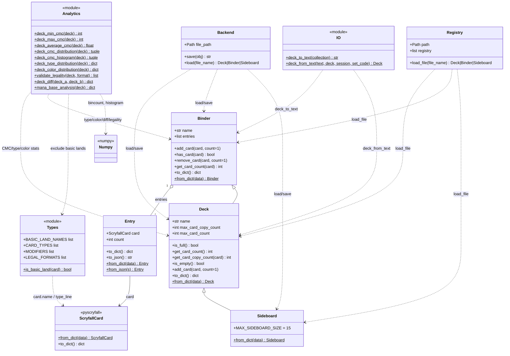

# pymtgdeck

Python library for maintaining **Magic: The Gathering** virtual binders, constrained decks, and sideboards. Card data is represented with [pyscryfall](https://pypi.org/project/pyscryfall/) `ScryfallCard` objects (Scryfall-shaped JSON in and out).

- **License:** GNU General Public License v3.0 (see `LICENSE`)
- **Python:** 3.12+

## Project structure

The package uses a **src layout** (importable code under `src/`), tests and fixtures beside the tree root, and **uv** for lockfile and dev dependencies. Domain types live under `entities/`; disk persistence under `persistence/`; text I/O in `io.py`.

```text
pymtgdeck/
├── LICENSE
├── README.md                 # this file
├── pyproject.toml            # project metadata, pytest config, hatchling build
├── uv.lock                   # locked dependency versions (uv)
├── src/
│   └── pymtgdeck/
│       ├── __init__.py       # public exports
│       ├── io.py             # deck_to_text / deck_from_text (plain-text format)
│       ├── entities/
│       │   ├── entry.py      # Entry (card + quantity)
│       │   ├── binder.py     # Binder (unlimited collection semantics)
│       │   ├── deck.py       # Deck (subclass with size / copy limits)
│       │   ├── sideboard.py  # Sideboard (Deck subclass, fixed 15-card limit)
│       │   ├── types.py      # MTG helpers (is_basic_land, CARD_TYPES, LEGAL_FORMATS, …)
│       │   └── analytics.py  # deck analytics (CMC, type/color distribution, legality, diff, mana base)
│       └── persistence/
│           ├── backend.py    # save/load Deck, Binder, and Sideboard to JSON files
│           └── registry.py   # scan a folder of saved JSON and list metadata
└── tests/
    ├── utils.py              # helpers: load Scryfall list JSON → first card
    ├── entry_test.py
    ├── binder_test.py
    ├── deck_test.py
    ├── sideboard_test.py
    ├── backend_test.py
    ├── registry_test.py
    ├── analytics_test.py
    ├── io_test.py
    └── data/
        ├── card-example-1.json
        ├── card-example-2.json
        └── card-example-3.json   # Scryfall API "list" JSON fixtures
```

## Class diagram

Relationships: a **Binder** holds a list of **Entry** instances; **Deck** subclasses **Binder** and adds validation and aggregate card counting; **Sideboard** subclasses **Deck** with a fixed 15-card limit. **Analytics** (`entities/analytics.py`) exposes module-level helpers that take a **Deck** or **Binder** and use **Types** to identify basic lands and card types. **Backend** writes and reads JSON envelopes for **Deck**, **Binder**, and **Sideboard**; **Registry** rescans a directory of those files for a lightweight index. **IO** provides plain-text import/export. **ScryfallCard** comes from **pyscryfall**, not from pymtgdeck.



**Notes:**

- On **Deck**, `get_card_count()` (no arguments) returns the **total** number of cards in the deck. On **Binder**, `get_card_count(card)` returns copies of **that** card. Deck uses `get_card_copy_count(card)` for per-card counts.
- **Analytics** functions are exported from `pymtgdeck` but are not methods on **Deck**. CMC helpers (`deck_cmc_distribution`, `deck_cmc_histogram`, `deck_average_cmc`) are **weighted by copy count** (`Entry.count`). See [Deck analytics](#deck-analytics).

## Installation

From the repository root, using [uv](https://docs.astral.sh/uv/):

```bash
uv sync
```

Or install the package in editable mode with your preferred tool (example with pip):

```bash
pip install -e .
```

Runtime dependencies: `pyscryfall==0.2.0` and `numpy>=2.4.6` (declared in `pyproject.toml`).

## Usage examples

### Binder (no deck limits)

```python
from pyscryfall import search_cards_by_name
from pymtgdeck import Binder

binder = Binder(name="Trade binder")  # name is optional; used in serialization and persistence
results = search_cards_by_name("Sengir Vampire")
card = results.data[0]

binder.add_card(card, count=2)
assert binder.has_card(card)
assert binder.get_card_count(card) == 2

binder.remove_card(card, count=1)
assert binder.get_card_count(card) == 1
```

### Deck (default limits: 40 cards, 4 copies per card)

```python
from pyscryfall import search_cards_by_name
from pymtgdeck import Deck

deck = Deck(name="Sealed pool")  # or Deck(max_card_count=60, max_card_copy_count=4, name="...")
results = search_cards_by_name("Forest")
forest = results.data[0]

deck.add_card(forest, count=4)
assert deck.get_card_count() == 4  # total cards
assert deck.get_card_copy_count(forest) == 4
assert not deck.is_full()
```

Default limits match the module constants `MAX_CARD_COUNT` and `MAX_CARD_COPY_COUNT` in `entities/deck.py` (40 and 4); you can override them per deck via the constructor.

### Sideboard (fixed 15-card limit)

`Sideboard` is a `Deck` subclass with a hard-coded maximum of 15 cards and the same 4-copy-per-card limit. Basic lands bypass the copy limit.

```python
from pymtgdeck import Sideboard

sideboard = Sideboard(name="My Sideboard")
assert sideboard.max_card_count == 15

sideboard.add_card(card, count=4)
assert sideboard.get_card_copy_count(card) == 4
assert not sideboard.is_full()
```

`Sideboard` serializes and persists via `to_dict()` / `from_dict()` and `Backend`, exactly like `Deck`.

### Serialization

`Binder.to_dict()` / `Binder.from_dict()` include an optional `name` plus `entries`. `Deck.to_dict()` / `Deck.from_dict()` also persist `max_card_copy_count` and `max_card_count`. `Sideboard.from_dict()` always restores `max_card_count` to 15.

```python
from pymtgdeck import Binder, Deck, Sideboard

binder = Binder(name="My binder")
# ... add cards ...

dump = binder.to_dict()
binder2 = Binder.from_dict(dump)

deck = Deck(name="My deck")
# ... add cards ...

deck_dump = deck.to_dict()
deck2 = Deck.from_dict(deck_dump)

sideboard = Sideboard(name="My sideboard")
# ... add cards ...

sb_dump = sideboard.to_dict()
sideboard2 = Sideboard.from_dict(sb_dump)
```

### Text import / export

`deck_to_text` and `deck_from_text` use the standard plain-text deck format: one entry per line as `<count> <card name>`. Lines starting with `//` are treated as comments and ignored; blank lines are skipped. `deck_from_text` looks each card up on Scryfall by exact name.

```python
from pymtgdeck import Deck, deck_to_text, deck_from_text

deck = Deck(name="FNM", max_card_count=60)
# ... add cards ...

text = deck_to_text(deck)
# "4 Lightning Bolt\n2 Counterspell\n..."

# Re-import (requires network access to Scryfall)
imported = deck_from_text(text, Deck(max_card_count=60))

# Optional kwargs: session (requests.Session) and set_code restrict the Scryfall lookup
imported_from_set = deck_from_text(text, Deck(), set_code="lea")
```

`deck_to_text` accepts any `Binder` (including `Deck` and `Sideboard`). `deck_from_text` returns a `Deck`; pass a pre-constructed `Deck` as the second argument to control limits, or omit it to get a default `Deck`.

### Persistence (`Backend`)

`Backend` writes each deck, binder, or sideboard to a single JSON file under a configurable directory (default `~/.pymtgdeck`). The on-disk shape is an **envelope** with `timestamp`, `type` (`"Deck"`, `"Binder"`, or `"Sideboard"`), `name` (same as the object's `name`), and `data` (the result of `to_dict()`).

The file basename is the SHA-256 hex digest of the UTF-8 encoded `name`, with a `.json` suffix. Saving again for the same `name` raises `OSError` so you do not silently overwrite an existing file.

```python
from pymtgdeck import Deck, Sideboard, Backend
from pathlib import Path

store = Path("/tmp/mtg-store")
backend = Backend(file_path=store)

deck = Deck(name="FNM")
# ... add cards ...

filename = backend.save(deck)          # returns e.g. "<hex>.json"
restored = backend.load(filename)

sideboard = Sideboard(name="FNM Side")
# ... add cards ...

sb_file = backend.save(sideboard)
sb_restored = backend.load(sb_file)   # returns a Sideboard instance
```

Use a non-`None` **`name`** on the object before `save`, so the filename is stable and hashing is defined.

### Registry scan (`Registry`)

`Registry` reads every `*.json` file in its directory (default `~/.pymtgdeck`). For each file whose envelope has `type` `"Deck"`, `"Binder"`, or `"Sideboard"`, it records `name`, `type`, and `timestamp` in an in-memory list. `str(registry)` pretty-prints that index. `Registry` also exposes `load_file` for reloading individual files.

### Entry and JSON fixtures

`Entry` wraps one `ScryfallCard` and a quantity, and can round-trip through dict/JSON shapes compatible with pyscryfall:

```python
from pymtgdeck import Entry

entry = Entry(card, count=3)
data = entry.to_dict()
restored = Entry.from_dict(data)
```

Tests load cards from files shaped like Scryfall's **card list** response (see `tests/data/*.json`), using `ScryfallCardList.from_json_string` and taking `data[0]`.

### Deck analytics

Analytics helpers live in `entities/analytics.py` and are exported from the package root. They operate on a `Deck` or `Binder`'s **entries** and **exclude basic lands** (Island, Plains, Swamp, Mountain, Forest) where noted.

CMC helpers weight by copy count (`Entry.count`) — a 4-of creature contributes 4 data points to the distribution.

| Function | Accepts | Role |
|----------|---------|------|
| `deck_min_cmc(deck)` | `Deck` | Lowest CMC among non–basic-land entries |
| `deck_max_cmc(deck)` | `Deck` | Highest CMC among non–basic-land entries |
| `deck_average_cmc(deck)` | `Deck` | Mean CMC of non–basic-land cards, weighted by copy count |
| `deck_cmc_distribution(deck)` | `Deck` | `(counts, bin_edges)` — copy-weighted counts per CMC bucket (`numpy.bincount` shape) |
| `deck_cmc_histogram(deck)` | `Deck` | Histogram over the distribution buckets (`numpy.histogram` shape) |
| `deck_type_distribution(deck)` | `Binder` | `{type: count}` — cards counted by primary type (Creature, Instant, …), weighted by copies; a card matching multiple types is counted in each |
| `deck_color_distribution(deck)` | `Binder` | `{color: pip_count}` — colored mana pips (W/U/B/R/G) across all non-basic-land cards, weighted by copies |
| `validate_legality(deck, format)` | `Binder` | Returns a list of card names not legal in the given format string (e.g. `"modern"`, `"standard"`) |
| `deck_diff(deck_a, deck_b)` | `Binder` | `{"added": [...], "removed": [...], "changed": [...]}` — entries present only in `deck_b`, only in `deck_a`, or with a different count |
| `mana_base_analysis(deck)` | `Binder` | `{"pip_requirements": {color: int}, "mana_sources": {color: int}, "warnings": [str]}` — compares pip demand to land supply and surfaces imbalances |

An empty deck (or one with only basic lands) yields empty arrays from the distribution/histogram helpers. `deck_min_cmc` / `deck_max_cmc` / `deck_average_cmc` raise `ValueError` when there are no qualifying entries.

```python
from pymtgdeck import (
    Deck,
    deck_cmc_distribution, deck_average_cmc, deck_max_cmc, deck_min_cmc,
    deck_type_distribution, deck_color_distribution,
    validate_legality, deck_diff, mana_base_analysis,
)

deck = Deck(name="Curve check")
# ... add cards ...

low, high = deck_min_cmc(deck), deck_max_cmc(deck)
avg = deck_average_cmc(deck)
counts, bin_edges = deck_cmc_distribution(deck)
by_type = deck_type_distribution(deck)
by_color = deck_color_distribution(deck)
illegal = validate_legality(deck, "modern")
analysis = mana_base_analysis(deck)

deck2 = Deck(name="Updated")
# ... add/remove cards ...
diff = deck_diff(deck, deck2)
# {"added": [...], "removed": [...], "changed": [...]}
```

#### Available format strings for `validate_legality`

`LEGAL_FORMATS` (exported from `pymtgdeck`) lists all accepted format names: `standard`, `future`, `historic`, `timeless`, `gladiator`, `pioneer`, `modern`, `legacy`, `pauper`, `vintage`, `penny`, `commander`, `oathbreaker`, `standardbrawl`, `brawl`, `alchemy`, `paupercommander`, `duel`, `oldschool`, `premodern`, `predh`, `tlr`.

### Exported constants

`pymtgdeck` exports the following constants from `entities/types.py`:

| Name | Contents |
|------|----------|
| `BASIC_LAND_NAMES` | `["Island", "Plains", "Swamp", "Mountain", "Forest"]` |
| `CARD_TYPES` | `["Land", "Creature", "Instant", "Sorcery", "Enchantment", "Artifact", "Planeswalker"]` |
| `MODIFIERS` | `["Snow", "Snow-Covered", "Legendary", "Mythic"]` |
| `LEGAL_FORMATS` | Full list of Scryfall format strings accepted by `validate_legality` |

## Test procedure

Tests use **pytest** (dev dependency). Configuration lives in `pyproject.toml` under `[tool.pytest.ini_options]` (`testpaths = ["tests"]`, `pythonpath = ["."]` so `src` resolves when running from the repo root).

**Run the full suite** from the repository root:

```bash
uv run pytest
```

If a virtual environment is already activated with dev dependencies installed:

```bash
pytest tests/
```

**Useful variants:**

```bash
pytest tests/ -q              # quiet
pytest tests/deck_test.py     # single module
pytest tests/ -k serialization  # tests whose name contains the substring
```

The suite covers `Entry`, `Binder`, `Deck`, and `Sideboard` (add/remove, limits, serialization, optional `name`), `Backend` save/load and collision behavior, deck CMC analytics (`analytics_test.py`), and plain-text import/export (`io_test.py`). Fixtures are offline JSON files; tests that call `search_cards_by_name` would need network access and are not part of the default suite.

## AI Disclosure

Part of this project has been developed with the help of an AI Model. Specifically I used a locally-hosted [QWEN3-CODER](https://ollama.com/library/qwen3-coder) using [Ollama](https://ollama.ai).
