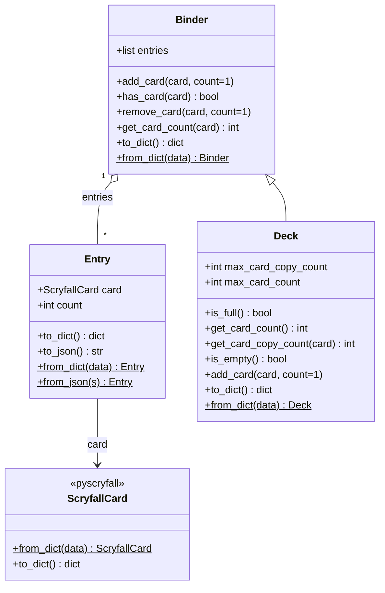

# pymtgdeck

Python library for maintaining **Magic: The Gathering** virtual binders and constrained decks. Card data is represented with [pyscryfall](https://pypi.org/project/pyscryfall/) `ScryfallCard` objects (Scryfall-shaped JSON in and out).

- **License:** GNU General Public License v3.0 (see `LICENSE`)
- **Python:** 3.12+

## Project structure

The package uses a **src layout** (importable code under `src/`), tests and fixtures beside the tree root, and **uv** for lockfile and dev dependencies.

```text
pymtgdeck/
├── LICENSE
├── README.md                 # this file
├── pyproject.toml            # project metadata, pytest config, hatchling build
├── uv.lock                   # locked dependency versions (uv)
├── src/
│   └── pymtgdeck/
│       ├── __init__.py       # public exports: Entry, Binder, Deck
│       ├── entry.py          # Entry (card + quantity)
│       ├── binder.py         # Binder (unlimited collection semantics)
│       └── deck.py           # Deck (subclass with size / copy limits)
└── tests/
    ├── utils.py              # helpers: load Scryfall list JSON → first card
    ├── entry_test.py
    ├── binder_test.py
    ├── deck_test.py
    └── data/
        ├── card-example-1.json
        ├── card-example-2.json
        └── card-example-3.json   # Scryfall API “list” JSON fixtures
```

## Class diagram

Relationships: a **Binder** holds a list of **Entry** instances; **Deck** subclasses **Binder** and adds validation and aggregate card counting. **ScryfallCard** comes from **pyscryfall**, not from pymtgdeck.



**Note:** On **Deck**, `get_card_count()` (no arguments) returns the **total** number of cards in the deck. On **Binder**, `get_card_count(card)` returns copies of **that** card. Deck uses `get_card_copy_count(card)` for per-card counts.

## Installation

From the repository root, using [uv](https://docs.astral.sh/uv/):

```bash
uv sync
```

Or install the package in editable mode with your preferred tool (example with pip):

```bash
pip install -e .
```

Runtime dependency: `pyscryfall==0.1.2` (declared in `pyproject.toml`).

## Usage examples

### Binder (no deck limits)

```python
from pyscryfall import search_cards_by_name
from pymtgdeck import Binder

binder = Binder()
results = search_cards_by_name("Sengir Vampire")
card = results.data[0]

binder.add_card(card, count=2)
assert binder.has_card(card)
assert binder.get_card_count(card) == 2

binder.remove_card(card, count=1)
assert binder.get_card_count(card) == 1
```

### Deck (default limits: 40 cards, 4 copies per card)

```python
from pyscryfall import search_cards_by_name
from pymtgdeck import Deck

deck = Deck()  # or Deck(max_card_count=60, max_card_copy_count=4)
results = search_cards_by_name("Forest")
forest = results.data[0]

deck.add_card(forest, count=4)
assert deck.get_card_count() == 4  # total cards
assert deck.get_card_copy_count(forest) == 4
assert not deck.is_full()
```

### Serialization

```python
from pymtgdeck import Binder, Deck

binder = Binder()
# ... add cards ...

dump = binder.to_dict()
binder2 = Binder.from_dict(dump)

deck = Deck()
# ... add cards ...

deck_dump = deck.to_dict()
deck2 = Deck.from_dict(deck_dump)
```

### Entry and JSON fixtures

`Entry` wraps one `ScryfallCard` and a quantity, and can round-trip through dict/JSON shapes compatible with pyscryfall:

```python
from pymtgdeck import Entry

entry = Entry(card, count=3)
data = entry.to_dict()
restored = Entry.from_dict(data)
```

Tests load cards from files shaped like Scryfall’s **card list** response (see `tests/data/*.json`), using `ScryfallCardList.from_json_string` and taking `data[0]`.

## Test procedure

Tests use **pytest** (dev dependency). Configuration lives in `pyproject.toml` under `[tool.pytest.ini_options]` (`testpaths = ["tests"]`, `pythonpath = ["."]` so `src` resolves when running from the repo root).

**Run the full suite** from the repository root:

```bash
uv run pytest
```

If a virtual environment is already activated with dev dependencies installed:

```bash
pytest tests/
```

**Useful variants:**

```bash
pytest tests/ -q              # quiet
pytest tests/deck_test.py     # single module
pytest tests/ -k serialization  # tests whose name contains the substring
```

The suite currently covers `Entry`, `Binder`, and `Deck` (add/remove, limits, serialization). Fixtures are offline JSON files; tests that call `search_cards_by_name` would need network access and are not part of the default suite.
